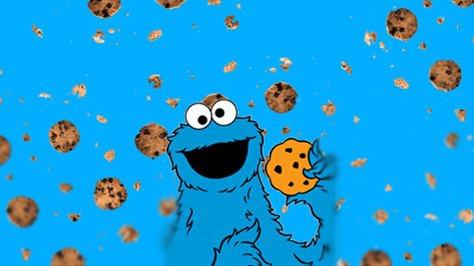

# ReactionTimer (TouchGFX / STM32H750)

A Cookie clicker game built with **TouchGFX** for the **STM32H750 Discovery Kit**.  
User must tap a cookie to progress through levels.

---

## Features

- Touch button-based cookie clicker

---

## Requirements

- [STM32CubeIDE](https://www.st.com/en/development-tools/stm32cubeide.html)
- [STM32CubeProgrammer](https://www.st.com/en/development-tools/stm32cubeprog.html)
- [TouchGFX Designer](https://www.st.com/en/development-tools/touchgfxdesigner.html)
- STM32H750B-DK Discovery Kit
- Micro USB cable

---

## Setup Instructions

1. **Clone this repository**
    ```bash
    git clone https://github.com/mattbernot/CookieClicker_STM32H750B.git
    cd ReactionTimer
    ```
1.1 **Or download a zip in [Releases](https://github.com/mattbernot/CookieClicker_STM32H750B/releases) and extract it**
    

2. **Open the `CookieClicker.touchgfx` file** with **TouchGFX Designer**:
    - Click on generate code
    - Run simulator or build & run if you have STM32H750B-DK connected.

3.1. **Or build the project in STM32CubeIDE**
    - Set the build target to `STM32H750B-DK`
    - Build the project (`Project > Build Project`)
    - Flash it to your `STM32H750B-DK` (`Run > Debug` or `Run > Run`)

---

## How It Works

1. Click on the big cookie.
2. Reach level 10 to win.

---



---

## Youtube overview
[](https://www.youtube.com/watch?v=qk-OavF2OSA)
